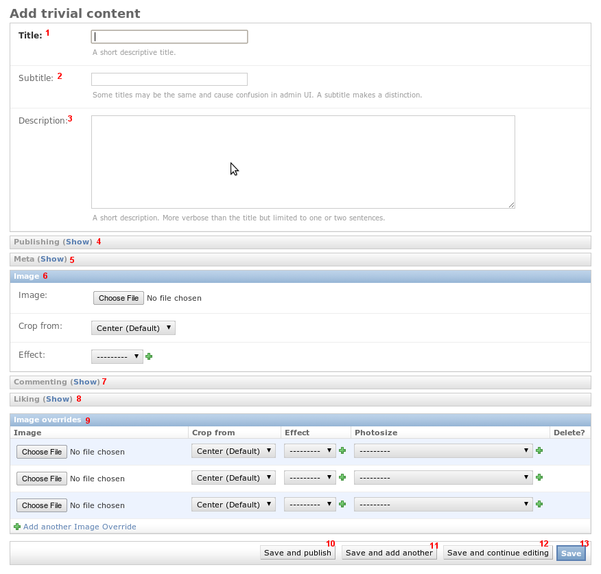

Jmbo
====
**The Jmbo base product introduces a content type and various tools required to build Jmbo products.**

.. contents:: Contents
    :depth: 5

Overview
--------

Jmbo is a CMS built on Django enabling you to rapidly build multilingual web
and mobi sites with the minimum amount of code and customization.

The Jmbo base product introduces abstract models and concepts that are used in
Jmbo products.

Content types
-------------

Trivial content type
********************
Jmbo itself has no content type. For our purposes assume a trivial content type
called Trivial Content.

1. Title is self-explanatory.

2.  Subtitle is an optional field that is only visible in the admin interface.
    If you have two items with the same title (a common case in multilingual sites)
    then add extra text in the subtitle to distinguish between the items.

3.  Description is an optional field. It is good practice to set it since 
    sites like Facebook read it when content is shared.

4. See below.

5. See below.

6.  You should always attempt to set an image since sites look dull without them! 
    All popular formats up to 1MB in size are supported. An aspect ratio of 4:3 
    is preferred but an attempt is made to convert the uploaded image into 
    a 4:3 format. Applications may override this aspect ratio as they wish.

    `Crop from` and `Effect` is for advanced use. `Crop from` is used when the 
    default cropping algorithm is eg. chopping a person's head off.

7. See below.

8. See below.

9.  Image overrides are for advanced use. The image you upload in 6 is
    converted behind the scenes into potentially many sizes. If the algorithm
    produces undesirable results you can override each size as required.

10. `Save and publish` saves the item and makes it publicly accessible.    

11. `Save and add another` saves the item. You are redirected to a screen to
    add a new trivial content item.

12. `Save and continue editing` saves the item. You stay on the edit screen.

13. `Save` saves the item. You are redirected to a listing of all trivial
    content items.
